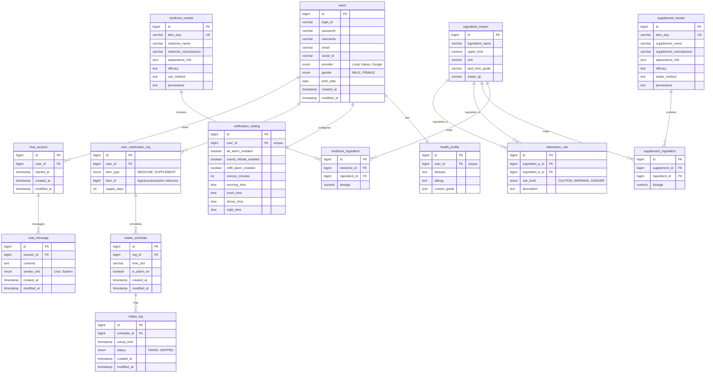

# SafePill ERD

`user_medication_reg.item_id` is intentionally not a physical FK. It is a polymorphic reference: when `item_type = MEDICINE`, it points to `medicine_master.id`; when `item_type = SUPPLEMENT`, it points to `supplement_master.id`.
